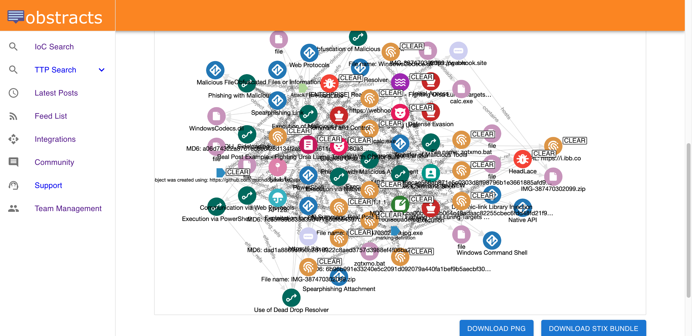
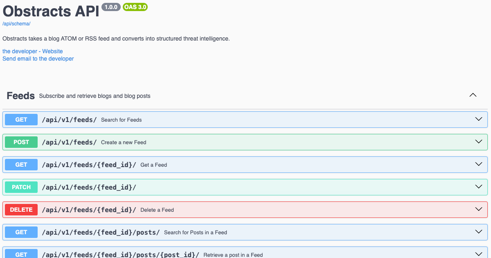

# Obstracts

[](https://codecov.io/gh/muchdogesec/obstracts)

## Before you begin...



We offer a fully hosted web version of Obstracts which includes many additional features over those in this codebase. [You can find out more about the web version here](https://www.obstracts.com/).

## Overview



Obstracts takes a blog ATOM or RSS feed and converts into structured threat intelligence.

Organisations subscribe to lots of blogs for security information. These blogs contain interesting indicators of malicious activity (e.g. malicious URL).

To help automate the extraction of this information, Obstracts automatically downloads blog articles and extracts indicators for viewing to a user.

It works at a high level like so:

1. A feed is added to Obstracts by user (selecting profile to be used)
2. Obstracts uses history4feed as a microservice to handle the download and storage of posts.
3. The HTML from history4feed for each blog post is converted to markdown using file2txt in `html` mode
4. The markdown is run through txt2stix where txt2stix pattern extractions/whitelists/aliases are run based on staff defined profile
5. STIX bundles are generated for each post of the blog, and stored in an ArangoDB database called `obstracts_database` and Collections names matching the blog
6. A user can access the bundle data or specific objects in the bundle via the API
7. As new posts are added to remote blogs, user makes request to update blog and these are requested by history4feed

## Install

### Download and configure

```shell
# clone the latest code
git clone https://github.com/muchdogesec/obstracts
```

### Pre-requisites

ArangoDB and Postgres must be running. We do not set these up in the compose file.

If you are not sure what you are doing here, follow the basic setup steps here.

### Configuration options

Obstracts has various settings that are defined in an `.env` file.

To create a template for the file:

```shell
cp .env.example .env
```

To see more information about how to set the variables, and what they do, read the `.env.markdown` file.

### Build the Docker Image

```shell
sudo docker compose build
```

### Start the server

```shell
sudo docker compose up
```

### Access the server

The webserver (Django) should now be running on: http://127.0.0.1:8001/

You can access the Swagger UI for the API in a browser at: http://127.0.0.1:8001/api/schema/swagger-ui/

## Contributing notes

Obstracts is made up of different core external components that support most of its functionality.

At a high-level the Obstracts pipeline looks like this: https://miro.com/app/board/uXjVKD2mg_0=/

Generally if you want to improve how Obstracts performs functionality, you should address the changes in;

* [history4feed](https://github.com/muchdogesec/history4feed): responsible for downloading the blog posts, including the historical archive, and keep posts updated
* [file2txt](https://github.com/muchdogesec/file2txt/): converts the HTML post content into a markdown file (which is used to extract data from)
* [txt2stix](https://github.com/muchdogesec/txt2stix): turns the markdown file into STIX objects
* [stix2arango](https://github.com/muchdogesec/stix2arango): manages the logic to insert the STIX objects into the database
* [dogesec_commons](https://github.com/muchdogesec/dogesec_commons): where the API Objects, Profiles, Extractors, Whitelist and Alias endpoints are imported from 

For anything else, then the Obstracts codebase is where you need to be :)

## Useful supporting tools

* [Turn any blog post into structured threat intelligence](https://www.dogesec.com/blog/launching_obstracts_open_source/)
* [An up-to-date list of threat intel blogs that post cyber threat intelligence research](https://github.com/muchdogesec/awesome_threat_intel_blogs)

## Support

[Minimal support provided via the DOGESEC community](https://community.dogesec.com/).

## License

[Apache 2.0](/LICENSE).